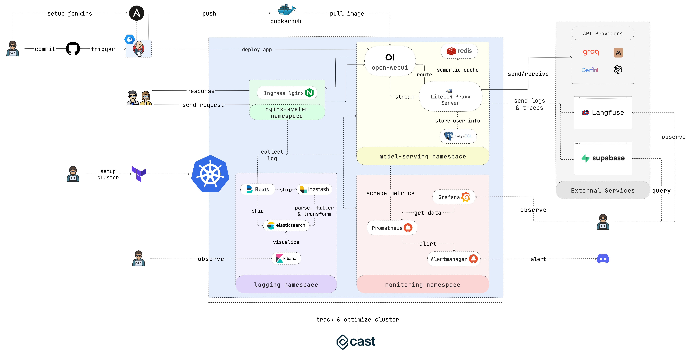

# EasyLLMOps
[](https://api.github.com/repos/bmd1905/EasyLLMOps)

EasyLLMOps: MLOps đơn giản hóa cho các Mô hình Ngôn ngữ Mạnh mẽ.

 [](#features)

## Giới thiệu

EasyLLMOps là một dự án được xây dựng với Open WebUI có thể triển khai trên Google Kubernetes Engine (GKE) để quản lý và mở rộng các mô hình ngôn ngữ. Dự án cung cấp cả phương pháp triển khai bằng Terraform và thủ công, đồng thời tích hợp các phương pháp MLOps mạnh mẽ. Điều này bao gồm quy trình CI/CD với Jenkins và Ansible để tự động hóa, giám sát với Prometheus và Grafana để nắm bắt hiệu suất, và ghi log tập trung với ELK stack để khắc phục sự cố và phân tích. Các nhà phát triển có thể tìm thấy tài liệu chi tiết và hướng dẫn trên trang web của dự án.

## Tính năng

- **Dễ sử dụng**: EasyLLMOps cung cấp giao diện trực quan và quy trình làm việc đơn giản giúp việc quản lý LLM đơn giản và hiệu quả, bất kể bạn có kinh nghiệm hay không.
- **Khả năng mở rộng & Linh hoạt**: Mở rộng triển khai LLM một cách dễ dàng, thích ứng với nhu cầu thay đổi, và tích hợp liền mạch với cơ sở hạ tầng hiện có của bạn.
- **Giảm độ phức tạp**: Loại bỏ phiền phức của cấu hình phức tạp và quản lý cơ sở hạ tầng, cho phép bạn tập trung vào việc xây dựng và triển khai các ứng dụng LLM mạnh mẽ.
- **Tăng năng suất**: Đẩy nhanh vòng đời phát triển LLM, tối ưu hóa hiệu suất và tối đa hóa tác động của các mô hình ngôn ngữ của bạn.

## Đối tượng mục tiêu

- Các nhà phát triển xây dựng và triển khai các ứng dụng sử dụng LLM.
- Các nhà khoa học dữ liệu và kỹ sư học máy làm việc với LLM.
- Các đội DevOps chịu trách nhiệm quản lý cơ sở hạ tầng LLM.
- Các tổ chức muốn tích hợp LLM vào hoạt động của họ.

## Mục lục

- [Giới thiệu](#introduction)
- [Tính năng](#features) 
- [Đối tượng mục tiêu](#target-audience)
- [Bắt đầu](#getting-started)
  - [Khởi động nhanh](#quick-start)
  - [Sử dụng Terraform cho Google Kubernetes Engine (GKE)](#using-terraform-for-google-kubernetes-engine-gke)
    - [Thiết lập Cluster](#set-up-the-cluster)
    - [Lấy thông tin Cluster](#retrieve-cluster-information)
  - [Triển khai thủ công lên GKE](#manual-deployment-to-gke)
    - [Triển khai Nginx Ingress Controller](#deploy-nginx-ingress-controller)
    - [Cấu hình API Key Secret](#configure-api-key-secret)
    - [Cấp quyền](#grant-permissions)
    - [Triển khai dịch vụ cache sử dụng Redis](#deploy-caching-service-using-redis)
    - [Triển khai LiteLLM](#deploy-litellm)
    - [Triển khai Open WebUI](#deploy-the-open-webui)
    - [Trải nghiệm ứng dụng](#play-around-with-the-application)
  - [Tích hợp liên tục/Triển khai liên tục (CI/CD) với Jenkins và Ansible](#continuous-integrationcontinuous-deployment-cicd-with-jenkins-and-ansible)
    - [Thiết lập máy chủ Jenkins](#set-up-jenkins-server)
    - [Truy cập Jenkins](#access-jenkins)
    - [Cài đặt Jenkins Plugins](#install-jenkins-plugins)
    - [Cấu hình Jenkins](#configure-jenkins)
    - [Kiểm tra thiết lập](#test-the-setup)
  - [Giám sát với Prometheus và Grafana](#monitoring-with-prometheus-and-grafana)
    - [Tạo Discord webhook](#create-discord-webhook)
    - [Cấu hình Helm Repositories](#configure-helm-repositories)
    - [Cài đặt các phụ thuộc](#install-dependencies)
    - [Triển khai Prometheus](#deploy-prometheus)
    - [Kiểm tra cảnh báo](#test-alerting)
  - [Logging với Filebeat + Logstash + Elasticsearch + Kibana](#logging-with-filebeat-logstash-elasticsearch-kibana)
    - [Chạy nhanh](#quick-run)
    - [Cài đặt ELK Stack với Helm](#install-elk-stack-with-helm)
    - [Truy cập Kibana](#access-kibana)
    - [Xác minh thu thập log](#verify-log-collection)
  - [Tối ưu hóa Cluster với Cast AI](#cast-ai-optmize-cluster)
  - [Log và Trace với Langfuse và Supabase](#log-trace-langfuse-and-supabase)
- [Đóng góp](#contributing)
- [Giấy phép](#license)
- [Trích dẫn](#citation)
- [Liên hệ](#contact)

## Bắt đầu

Nếu bạn không muốn tốn nhiều thời gian, hãy chạy script này và thưởng thức cà phê của bạn:
```bash
chmod +x ./cluster.sh
./cluster.sh
```

Nhớ xác thực với GCP trước khi sử dụng Terraform:

```shell
gcloud auth application-default login
```

[Nội dung chi tiết về các bước triển khai và cấu hình giữ nguyên bằng tiếng Anh vì chứa các lệnh và code]

## Đóng góp
Chúng tôi hoan nghênh các đóng góp cho EasyLLMOps! Vui lòng xem CONTRIBUTING.md để biết thêm thông tin về cách bắt đầu.

## Giấy phép
EasyLLMOps được phát hành dưới Giấy phép MIT. Xem tệp LICENSE để biết thêm chi tiết.

## Trích dẫn
Nếu bạn sử dụng EasyLLMOps trong nghiên cứu của mình, vui lòng trích dẫn như sau:
```
@software{EasyLLMOps2024,
  author = {Minh-Duc Bui},
  title = {EasyLLMOps: Effortless MLOps for Powerful Language Models.},
  year = {2024},
  url = {https://github.com/bmd1905/EasyLLMOps}
}
```

## Liên hệ
Đối với các câu hỏi, vấn đề hoặc hợp tác, vui lòng mở một issue trên repository GitHub của chúng tôi hoặc liên hệ trực tiếp với người bảo trì.
